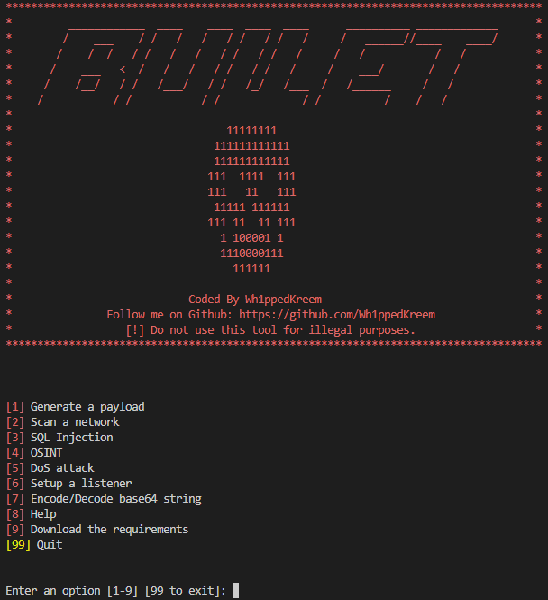

# **BULLET Framework** [](https://www.python.org/downloads/)

BULLET is a penetration testing framework with many of the necessary tools a hacker would need without the hassle of typing out all the commands. Now, you can setup a listener, generate a payload, run an SQLi scan, run a network scan, bruteforce service passwords, bruteforce hashes, scan for directories, scan for usernames, encode/decode base64 and perform DoS attacks all in one place. It's like a swiss army knife for hacking!

<p align="center">
  
</p>

### BULLET allows you to perform perform lengthy, cumbersome and constantly repeating commands with ease. It can:
 - Generate msfvenom payloads
 - Setup a listener
 - Perform Nmap scans
 - Run SQLmap scans
 - Run various OSINT tools
 - Encode and decode base64 strings
 - Bruteforce passwords on services with Hydra (COMING SOON)
 - Bruteforce password hashes with John The Ripper (COMING SOON)
 - Perform a DoS attack for stress testing servers (COMING SOON)

# **Installation**

## **[Linux](https://wikipedia.org/wiki/Linux) Installation:**
### Clone the repository: 
```
$ git clone https://github.com/Wh1ppedKreem/EZToolkit.git
```
### Change directory to "BULLET": 
```
$ cd BULLET
```
### Run BULLET as root: 
```
$ sudo python3 bullet.py
```
### Use the "Download the requirements" option [9]: 
```
Enter an option [1-9] [99 to exit]: 9
```

# License Information
The BULLET Framework is licensed under the GNU General Public License v3.0
